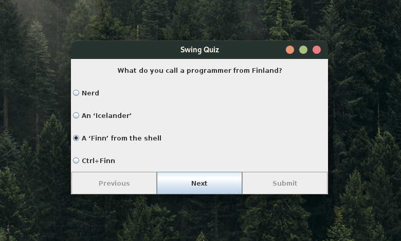
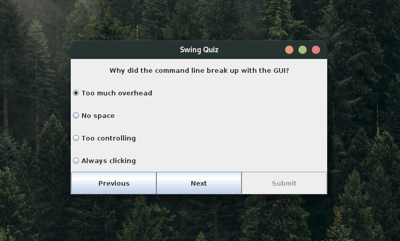
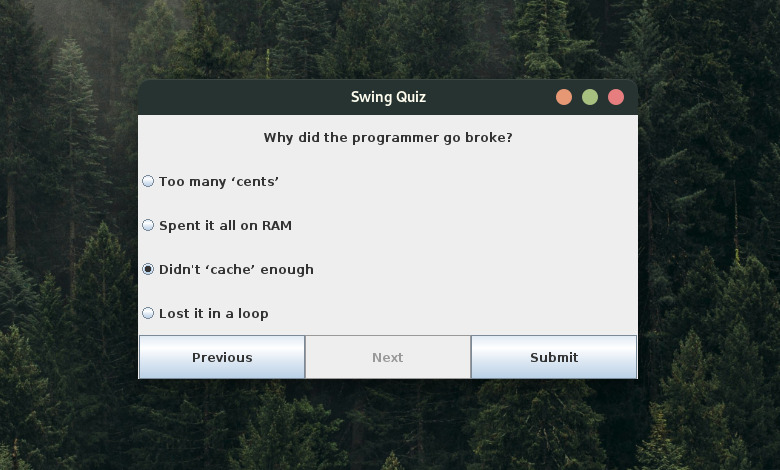
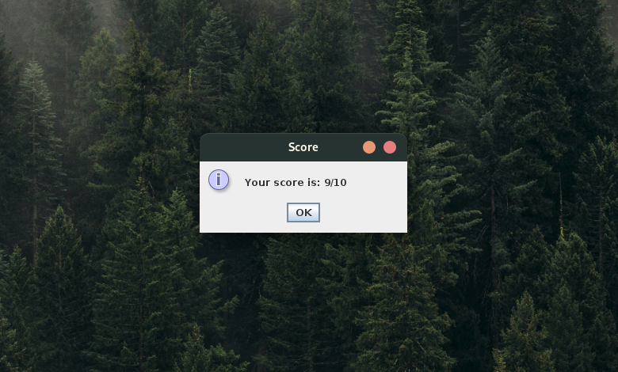

# Interface







# Swing Quiz App

This project is a Java Swing-based quiz application designed for a CSE 1116 Object-Oriented Programming assignment. Users can take a fun quiz on a chosen topic, answering multiple-choice questions and seeing their score at the end. The app uses a simple GUI interface with Java Swing, reads questions from a text file, and calculates scores based on correct answers.

## Features
- **User Interface**: A main window with a "Start Quiz" button and dynamic question display.
- **Question Handling**: Reads questions and answer options from a `questions.txt` file. Each question has four answer options, only one of which is correct.
- **Score Calculation**: Keeps track of answers, calculates a score at the end of the quiz, and displays it to the user.

## Add Your Own Questions

If you want to customize the quiz questions, you can populate questions.txt with questions in the following format:
- **Question#Option1#Option2#Option3#Option4#CorrectOption**


## Requirements
- **Java SE Development Kit (JDK)** - Version 8 or later.
- **Java Swing Library** (included in JDK)

## Getting Started
1. **Clone the repository**
2. **Compile and run the application**:
   ```bash
   cd swing-quiz-app
   javac *.java
   java Main
